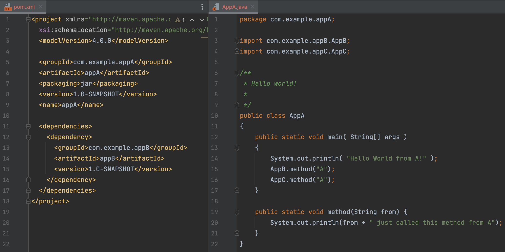
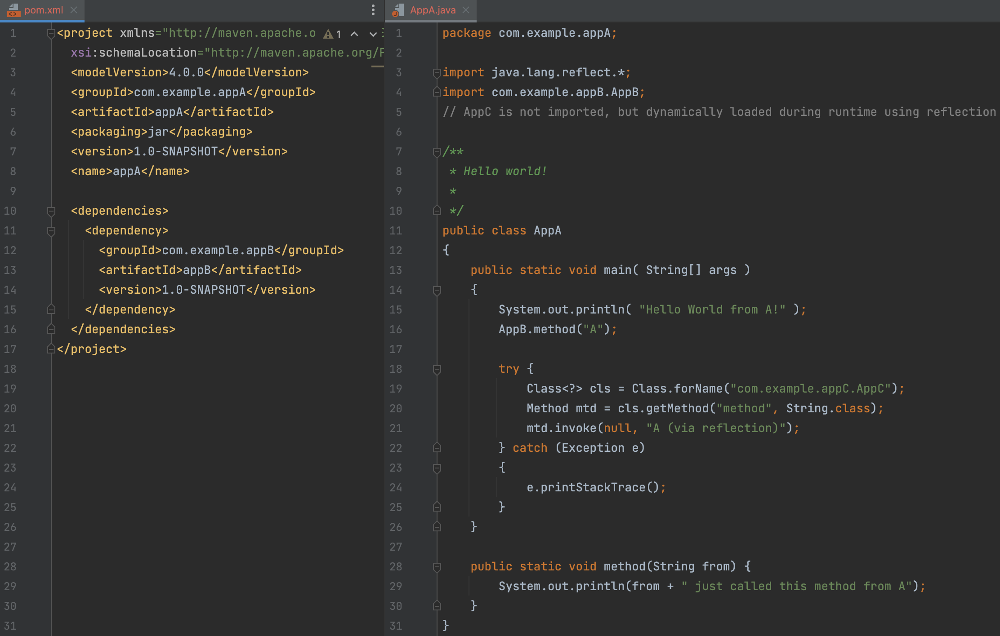

## Example 1: Simple direct use of transitive dependency

See `ex_1/` for the complete code.


The building of appA using this POM succeeds, and running appA results in the following output:

```
Hello World from A!
A just called this method from B
A just called this method from C

```

### Using the Maven Dependency Plugin (dependency:analyze)
Running `mvn dependency:analyze` (on CLI or as build plugin in appA's POM) is able to detect this usage:

```
[INFO] --- dependency:3.6.0:analyze (default-cli) @ appA ---
[WARNING] Used undeclared dependencies found:
[WARNING]    com.example.appC:appC:jar:1.0-SNAPSHOT:compile
[INFO] Add the following to your pom to correct the missing dependencies:
[INFO]
<dependency>
  <groupId>com.example.appC</groupId>
  <artifactId>appC</artifactId>
  <version>1.0-SNAPSHOT</version>
</dependency>
```
The `outputXML` will output the dependency to be added to the POM.


## Example 2: Direct use of transitive dependency using simple reflection

See `ex_2/` for the complete code.


The building of appA using this POM succeeds, and running appA results in the following output:

```
Hello World from A!
A just called this method from B
A (via reflection) just called this method from C

```
### Using the Maven Dependency Plugin (dependency:analyze)
Running `mvn dependency:analyze` on appA's POM is **not** able to detect this usage:

```
[INFO] --- dependency:3.6.0:analyze (default-cli) @ appA ---
[INFO] No dependency problems found
```
More specifically, `dependency:analyze` will not detect the cases where the class is loaded dynamically / via reflection.